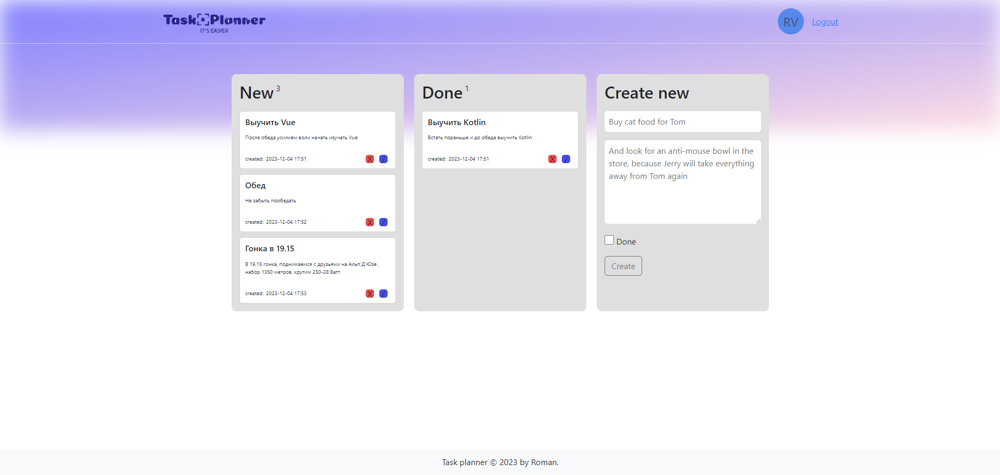

# Планировщик задач
Функционал и возможности приложения:
* регистрация
* авторизация
* необходимость подтверждения email после регистрации
* раз в сутки почтовое уведомление о закрытых и оставшихся задачах
* возможность создавать/редактировать/удалять/изменять статус задач

Принципиальное исполнение:
* Сервис отвечающий за фронт - исполнен по принципу single-page-application с использованием javaScript и jQuery.
* База данных - Postgresql.
* Обмен сообщениями - RabbitMQ.
* Rest Api - Java, Spring, SpringSecurity, Spring Data Jpa, Spring Amqp, FlyWay, Lombok, Jwt Token 
* Планировщик - Java, Spring
* Email модуль - Java, Spring Mail

Для деплоя приложения необходимо:
1. создать на сервере в папке пользователя директорию /conf/ , скопировать в нее два файла для конфигурирования RabbitMQ при старте:
/conf/definition.json, /conf/rabbitmq.conf
2. установить mime-support на сервер командой: sudo apt install mime-support
3. скопировать на сервер файл compose-prod.yaml
4. для установки credentional-ов в момент запуска docker compose скопировать на сервер файл .env , в котором задать следующие секьюрные переменные:

* DB_PASSWORD= пароль базы данных
* RMQ_PASSWORD=password (оставить пароль password, если хотите изменить, необходимо будет внести хеш вашего пароля в файлы конфигурации Rabbit указанные выше)
* PUBLIC_HOST= хост где будет доступен UI сервис вашего приложения
* JWT_SECRET= секрет для формирования JWT токена, 54 символа. Используйте буквы и цифры, служебные символы иногда приводят к невозможности использования секрета
* MAIL_USERNAME= email с которого вы будете отправлять почтовые уведомления(prod профиль настроен для использования google smtp, при использовании другого smtp провайдера, возможно понадобится изменение настроек в модуле рассылки)
* MAIL_PASSWORD= пароль для доступа к smtp серверу

**_После выполнения всех предыдущих шагов для запуска приложения выполните команду:_**
`docker compose -f compose-prod.yaml up -d`

Ссылки на репозитории сервисов приложения:

1. https://github.com/RomanV79/taskPlanner-user-service-mvn
2. https://github.com/RomanV79/taskplanner-ui-v2-mvn
3. https://github.com/RomanV79/taskplanner-mailservice-mvn
4. https://github.com/RomanV79/taskplanner-scheduler-mvn
